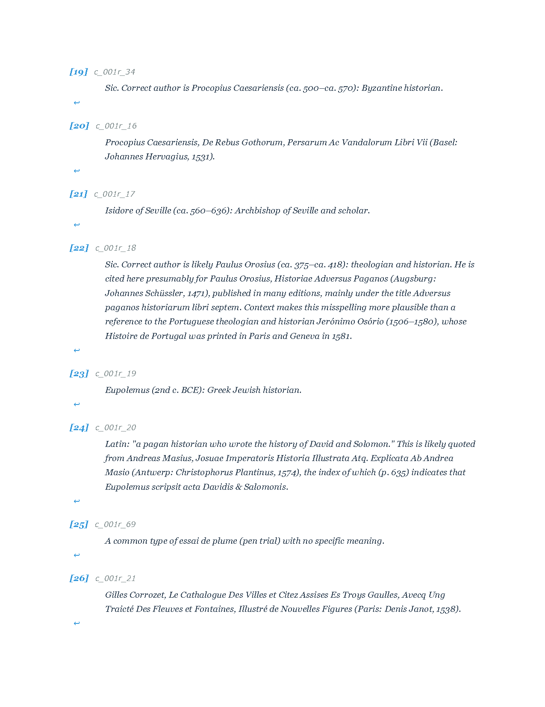
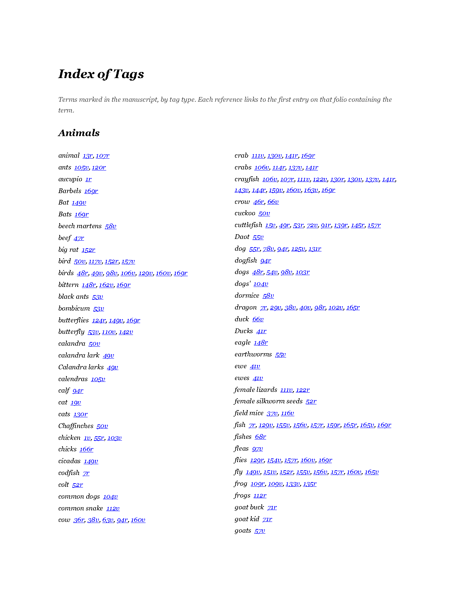
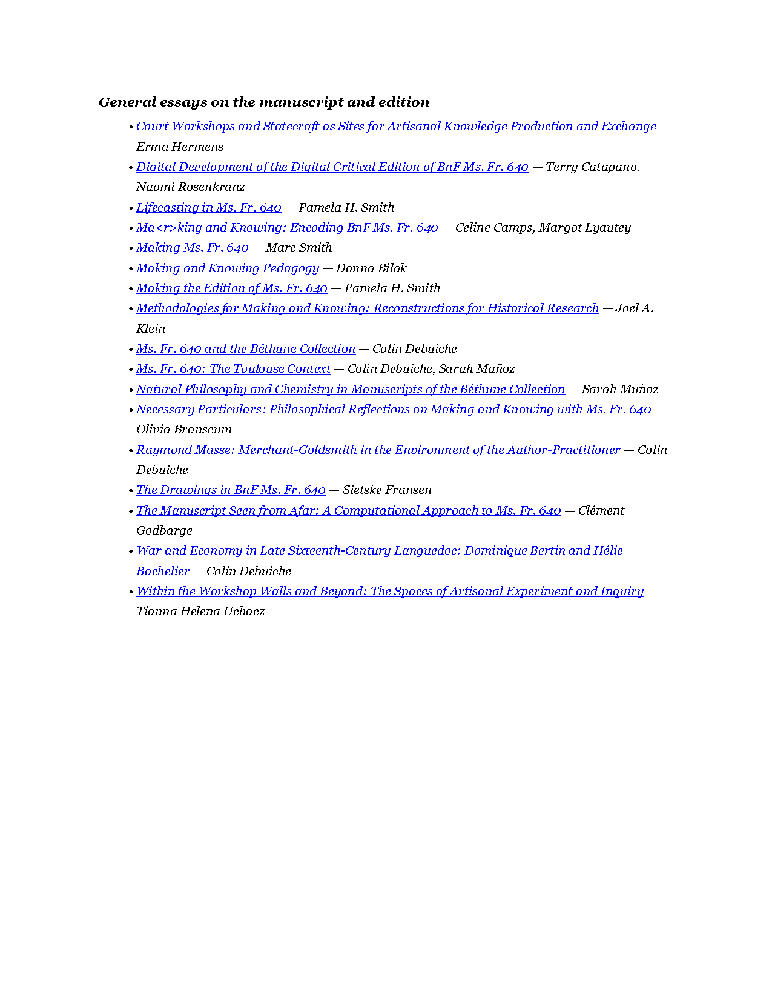
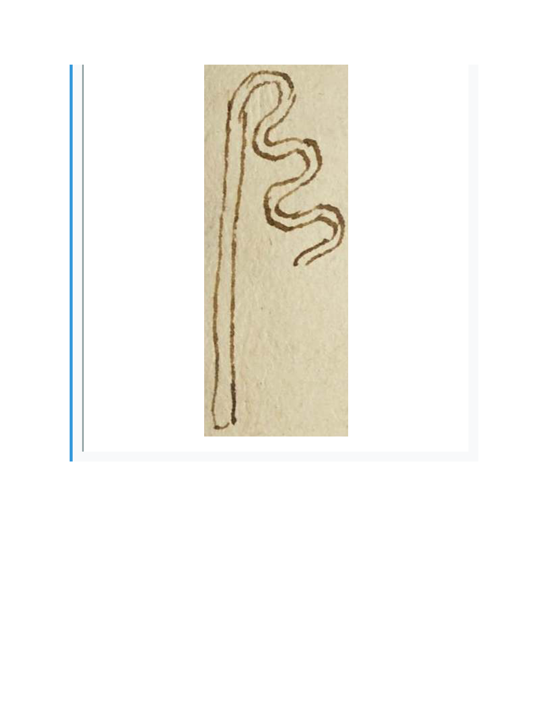
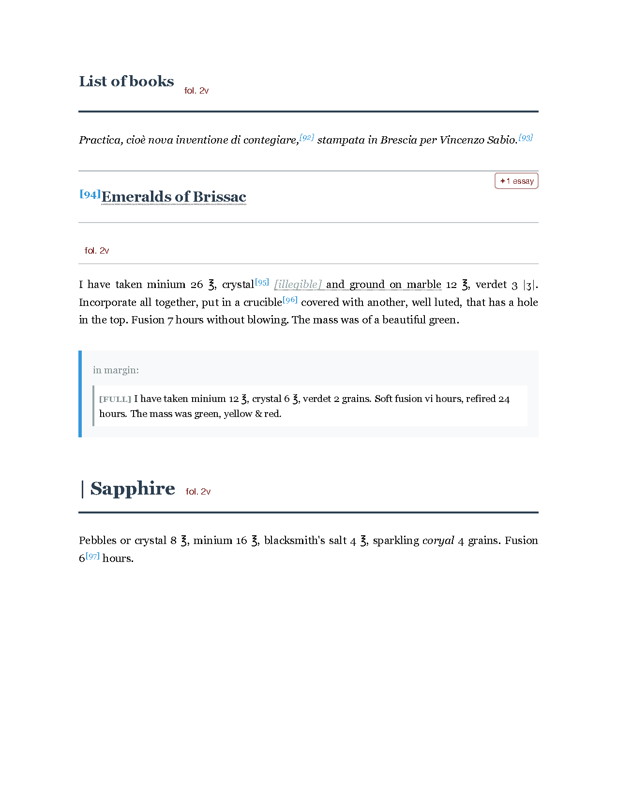
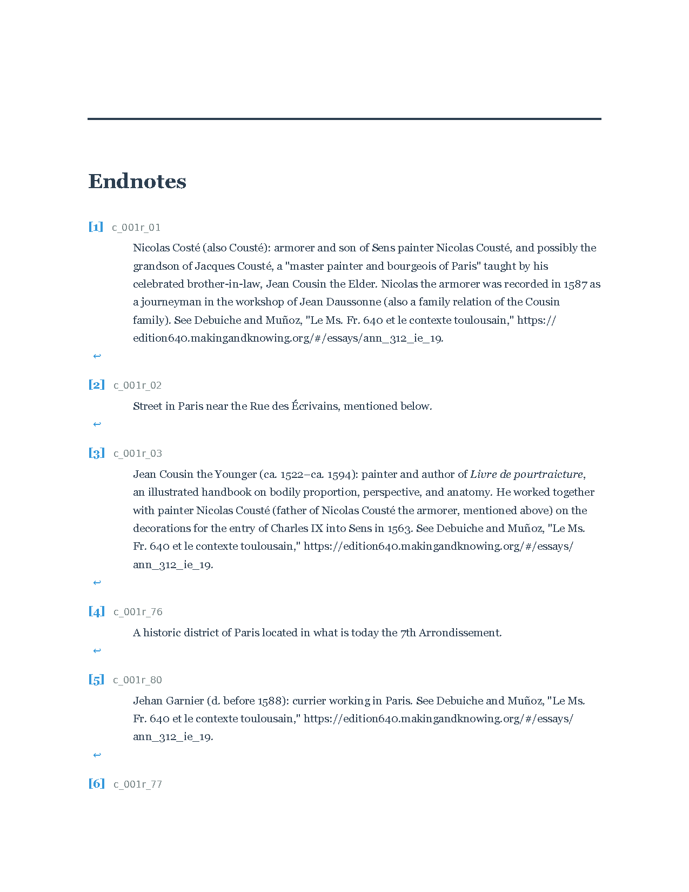
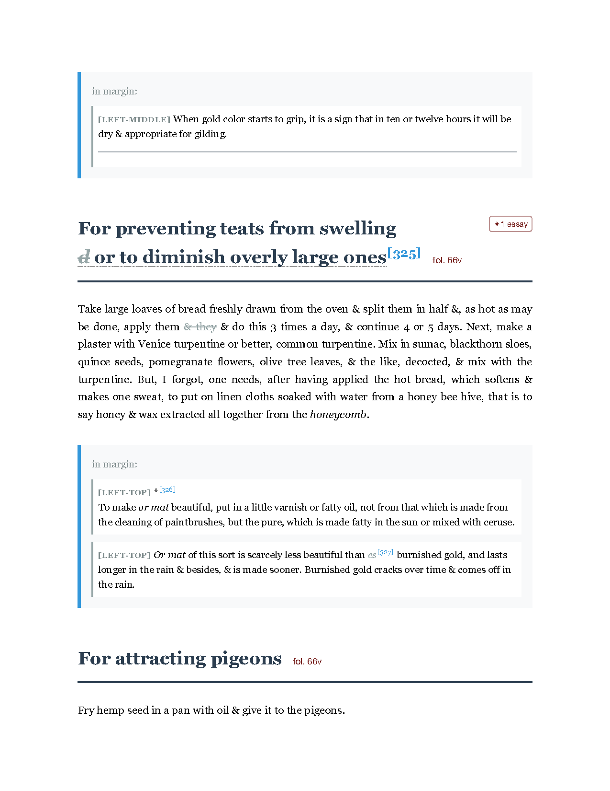

# Print production audit — `all_tl_figures.pdf`

**Audited** 2026-07-08 · **Document** `allFolios/pdf/all_tl_figures.pdf` (748 pp, commit `4d87b147`)
**Pipeline** `lib/generate_pdf_gemini.py` → HTML+CSS (embedded in the script) → WeasyPrint **69.0** → pypdf post-processing (`post_process_pdf_links`)
**Trim** US Letter 612 × 792 pt (8.5 × 11 in), 1 in margins · **Intended for** print + archival deposit

The same pipeline produces `all_tcn_figures.pdf`, `metadata/glossary.pdf` and `metadata/entry-metadata.pdf`; every root cause below except **R1** and **R9** applies to all four.

Sample: pp. 1, 2, 3, 5, 8, 39, 207, 241, 305, 339, 433, 513, 528, 540, 541, 543, 544, 632, 633, 665, 732, 748 — one instance per structural element type; indexes sampled at first and last page only. Rendered images in `qc/print-audit/pages/`.

**Nothing has been changed.** Scripts used: `step1_checks.py`, `step1_glyphs_images.py`.

---

## Step 1 — Programmatic results (whole document)

| Check | Result |
|---|---|
| Fonts | 12 faces, **all embedded, all subset**. No missing embeds. |
| Unexpected fallbacks | **Verdana-Italic** (6,674 glyphs, 90 pp), **Times-New-Roman** ×3 faces (22 glyphs), **DejaVu-Sans** (1,493), **Noto-Sans-Symbols** (6) — none of which appear in any authored font stack except DejaVu/Noto. See **R4**, **R5**. |
| Page geometry | 748/748 pages 612 × 792 pt, rotation 0. TrimBox = BleedBox = MediaBox (no bleed — correct for this trim). |
| Raster images | 165 placements. **123 below 300 PPI** (48 below 150). Min 96, median 199, max 2650. See **R3**. |
| Content overflow | **0 occurrences** — nothing crosses the page box or the 1 in margin. |
| Doc metadata | `/Producer: pypdf`; **no `/Title`, no `/Lang`, no XMP, no structure tree, no OutputIntents**. See **R9**. |

---

## Root causes, ordered by severity

### 🔴 R1 — Unclosed `<i>` in three endnote comments italicises the last 205 pages

**27% of the document (pp. 544–748, through the end) is set in italic.** All three back-of-book indexes are affected in full.





**Cause.** Endnote text is injected raw from `metadata/DCE_comment-tracking-Tracking.csv` with no tag balancing:

```python
# generate_pdf_gemini.py — endnotes assembly
if comment_text:
    endnotes_html += f'  <span class="endnote-text">{comment_text}</span>'
```

Three CSV rows have malformed italic markup — the same class of defect already fixed in the glossary data (`1cadb35c`):

| Comment | Defect |
|---|---|
| `Bargeo wrote two poems on hunting…` | `<i>` used twice where `</i>` intended (8 opens / 4 closes) |
| `Cf., the modern Greek <i>όφις<i/>` | `<i/>` instead of `</i>` |
| `Girolamo Mercuriale, <i>Liber responsorum…` | never closed |

Whole-document balance: **475 `<i>` opens, 469 closes.** The leak begins mid-note [18] and no later element ever closes it.

**Fix.** Two independent changes, both needed:
1. Pass endnote text through the existing `balance_inline_tags()` helper (already used for essay titles) — a one-line change that makes a data typo cost one note, not 205 pages.
2. Correct the three CSV rows, as was done for `DCE-glossary-table.csv`.

---

### 🔴 R2 — No page numbers anywhere; the document cannot be navigated in print

The `@page` rule carries no margin boxes:

```css
@page { size: letter; margin: 1in; }
```

There are no folios, no running heads, no section identification on any of 748 pages — see any sample image. The Table of Contents lists six sections with **no page references**, and both indexes reference *manuscript* folios (`fol. 17r`), which do not tell a reader where to turn in the codex.

**Fix.** Add margin boxes and named page contexts:

```css
@page { size: letter; margin: 1in 1in 1.1in; @bottom-center { content: counter(page); font: 9pt Georgia; } }
@page :first { @bottom-center { content: none; } }
```
Running heads keyed to the current entry (`string-set: entry content()` on `.head` + `@top-right { content: string(entry) }`) are the conventional next step, and would also fix "running header off by one at section boundaries" before it can occur. TOC/index page references require a two-pass build (WeasyPrint exposes `target-counter(attr(href), page)` — the indexes already carry the anchors needed).

---

### 🔴 R3 — 123 of 165 figures are below 300 PPI (48 below 150)



Placements sit at exactly **96 PPI** wherever the image is rendered at natural size (1 CSS px = 1/96 in); the higher values occur only where a `max-width` cap shrinks the image.

| Bucket | Placements |
|---|---|
| < 150 PPI | 48 |
| 150–224 PPI | 50 |
| 225–299 PPI | 25 |
| ≥ 300 PPI | 42 |

Examples of the shortfall (source width vs. what 300 PPI needs at the printed size):

| Page | Source | Printed width | Needs |
|---|---|---|---|
| 347 | 59 px | 0.61 in | 183 px |
| 199 | 83 px | 0.86 in | 258 px |
| 339 | 89 px | 0.93 in | 279 px |
| 95 | 104 px | 1.08 in | 324 px |

**Cause.** The source PNGs on `edition-assets.makingandknowing.org/manuscript-figures/` are screen-resolution derivatives. The CSS cannot fix this — the pixels do not exist.

**Fix.** This is an asset problem, not a CSS problem. Obtain print-resolution derivatives (the project holds the source facsimile photography); regenerate `images/` from those. Failing that, the print edition should state the figure resolution, and archival deposit should not claim 300 PPI compliance. Note `fig_p020r_1` is currently sourced from a Google Drive fallback (see #2125) and is not on the asset server at all.

---

### 🟠 R4 — Manuscript symbols are split across three fonts

The apothecary/alchemical signs — the scholarly point of the transcription — render in whichever fallback font first happens to have the glyph:

| Glyphs | Rendered in |
|---|---|
| ℥ ☿ ☾ ☀ ℞ 🜊 🝋 ↩ ✦ | DejaVu Sans / Noto Sans Symbols |
| **ʒ** (dram) **ʘ** **☼** **♀** **ὗ** | **Times New Roman** (regular, italic, bold) |

Visible on p.8 — the `ʒ` beside Georgia text is a different design, weight, and width from the `℥` two lines up.



**Cause.** Stack order in `get_css()`:

```css
body { font-family: "Garamond", "Georgia", "Times New Roman", "DejaVu Sans", "Noto Sans Symbols", serif; }
```

`Garamond` is not installed (silently → Georgia). `Times New Roman` precedes the bundled symbol fonts, so any glyph it happens to carry is claimed before DejaVu is consulted.

**Fix.** Remove `"Times New Roman"` from the stack (it is a system font, not bundled — a reproducibility hazard in its own right) so all symbol fallback resolves to the two bundled faces:
```css
font-family: "Georgia", "DejaVu Sans", "Noto Sans Symbols", serif;
```
Also drop `Garamond` or bundle it; naming an absent font is what produced the original hidden-font bug (`5012c77f`'s predecessor).

---

### 🟠 R5 — `font-family: monospace` resolves to an *italic* Verdana

Endnote identifiers (`c_001r_01`) render in **Verdana-Italic** across the 90-page endnote section — an italic face for a non-italic element, chosen by fontconfig:



```css
.endnote-id { font-family: monospace; … }   /* also .ms { font-family: monospace } */
```

**Cause.** A bare generic family with no explicit stack and no bundled monospace. The resolution is machine-dependent — a different build host will produce a different font, silently.

**Fix.** Either bundle a monospace face and name it explicitly, or (better for these two uses) drop `monospace`: endnote ids are editorial keys and `.ms` is a *measurement* in running prose, neither of which wants a typewriter face.

---

### 🟠 R6 — 177 of 538 body pages carry more than 2 in of trailing white space

Median void on affected pages **3.1 in**; worst **8.6 in** (p. 4 — an almost entirely blank page). p.241 is a whole page holding one figure.



**Cause.**

```css
.entry        { page-break-inside: avoid; }
.margin-notes { page-break-inside: avoid; }
```

An entry that will not fit in the remaining space is pushed whole to the next page. Manuscript entries routinely run longer than a page, so this both fails (the browser must break them anyway) and abandons the bottom half of the preceding page.

**Fix.** Remove `page-break-inside: avoid` from `.entry` and `.margin-notes`; keep it only on genuinely atomic objects (`.fig-inline`, `.fig-with-note`, a margin note that is a single figure). Add proper breaking hygiene instead:

```css
.head { break-after: avoid; }          /* never strand a heading */
p, .ab { orphans: 2; widows: 2; }
```

---

### 🟠 R7 — Screen chrome is printed as-is

Every page carries interface affordances that mean nothing on paper and cost four-colour printing:

* Hyperlinks in **blue with underline** (`a { color: #792421 }` is overridden for index/essay links; index entries are blue-underlined — see p.665, p.748).
* **991 `↩` back-link arrows**, each on its own line in the endnotes (p.541).
* Footnote references in cyan `#3498db`; margin notes in tinted boxes with a blue left rule; `[LEFT-MIDDLE]` position chips.
* The essay marker chip `✦ 2 essays` is a navigation control.

**Fix.** A print stylesheet pass: `a { color: inherit; text-decoration: none }`, `.endnote-backlink { display: none }`, neutralise `.comment-ref`/`.margin-note` colour to greyscale. If colour is retained deliberately for the deposit copy, that is a decision worth recording — but it should be a decision.

---

### 🟡 R8 — Justified text with no hyphenation, no widow/orphan control

`.ab { text-align: justify; }` with **zero** `hyphens`, `orphans`, or `widows` declarations anywhere in the stylesheet.

Consequences measured: **7 headings stranded** in the bottom 1.5 in of a page with almost no text following; **102 body pages end in a one- or two-word line**. Loose inter-word spacing is visible throughout p.8.

Note also that `<span class="fr">`, `.la`, `.it` carry **no `lang` attribute** (0 occurrences of `lang="fr"` in the HTML), so enabling hyphenation today would hyphenate French and Latin by English rules. Fix the tagging first:

```python
html = f'<span class="{tag}" lang="{XML_LANG[tag]}">'   # fr, la, it, el, oc, po
```
```css
html { hyphens: auto; }
p, .ab { orphans: 2; widows: 2; }
```

---

### 🟡 R9 — pypdf post-processing strips document metadata and `/Lang`

Verified experimentally against a minimal document:

| | `/Producer` | `/Title` | `/Lang` |
|---|---|---|---|
| WeasyPrint 69 output | `WeasyPrint 69.0` | `Test Doc` | `en` |
| after `post_process_pdf_links()` | `pypdf` | *(gone)* | *(gone)* |

`post_process_pdf_links()` rebuilds the file via `PdfWriter().append(reader)`, which does not carry the catalog's `/Lang` or the document information dictionary. For **archival deposit** the deliverable needs, at minimum, `/Title`, `/Lang`, XMP metadata, and ideally PDF/A-2b with `/OutputIntents`. None are present.

**Fix.** In the post-processing pass, copy `reader.metadata` onto the writer (`writer.add_metadata(...)`), re-set `/Lang` from the source catalog, and add `/Title`. PDF/A conformance is a separate, larger piece of work (Ghostscript `-dPDFA` or `verapdf` validation) worth scoping before deposit.

---

### 🟡 R10 — Whitespace artefacts around inline elements

XML serialisation drops the space that separates an element from adjacent text:

| Rendered | Should be | Page |
|---|---|---|
| `[94]Emeralds of Brissac` | `[94] Emeralds…` (marker abuts the heading) | 8 |
| `Mestre Nico[illegible] Costé` | `Mestre Nico [illegible] Costé` | 3 |
| `6[97] hours` | `6[97] hours` (correct — shown for contrast) | 8 |

**Cause.** `process_element()` emits `escape_html(elem.text)` and `escape_html(tail)` verbatim; where the XML has no whitespace between `<comment/>` and the following text node, none is produced. In the heading case the comment marker is emitted *before* the heading text with no separator.

**Fix.** Emit a hair space after a `comment` marker that abuts word characters, or normalise at the XML level. Low risk, cosmetic.

---

### 🟡 R11 — Raw URLs printed and broken mid-token

Endnote text contains bare URLs from the CSV, which justify badly and break across lines at arbitrary points (`https:// edition640.makingandknowing.org/#/essays/ann_312_ie_19` — p.541). They are plain text, not hyperlinks.

**Fix.** Wrap URLs in `<a>` at build time (they become clickable *and* get link annotations), and add `overflow-wrap: anywhere; hyphens: none` to `.endnote-text` so the break lands at a slash rather than after `https://`.

---

## Not found (checked, clean)

* No content overflowing the page box or margin (0 occurrences, whole document).
* No inconsistent page geometry or rotation.
* No un-embedded fonts.
* No figure/caption separation (captions were removed with the List of Figures in `43fac9c3`).
* No table borders lost across page breaks (the document contains no tables).
* No cross-references rendering as broken text; `Ma<r>king and Knowing` on p.748 is the essay's actual title, correctly escaped.

---

## Suggested triage order

| | Root cause | Effort | Blocks |
|---|---|---|---|
| 1 | **R1** italic leak | 1 line + 3 CSV cells | printing, and it is the first thing a reader sees in the indexes |
| 2 | **R2** page numbers | ~10 lines CSS (+ two-pass for TOC refs) | printing |
| 3 | **R6** white voids | 2 lines CSS | printing (paper cost) |
| 4 | **R9** metadata | ~5 lines | archival deposit |
| 5 | **R4**, **R5** font resolution | 2 lines CSS | reproducibility of every future build |
| 6 | **R3** figure PPI | asset re-derivation | archival deposit — *not solvable in CSS* |
| 7 | **R7**, **R8**, **R10**, **R11** | print stylesheet + tagging | quality |

R1, R4, R5, R6 are each a handful of lines and together resolve the majority of the visible defects. R3 is the only finding that cannot be fixed inside this pipeline.
